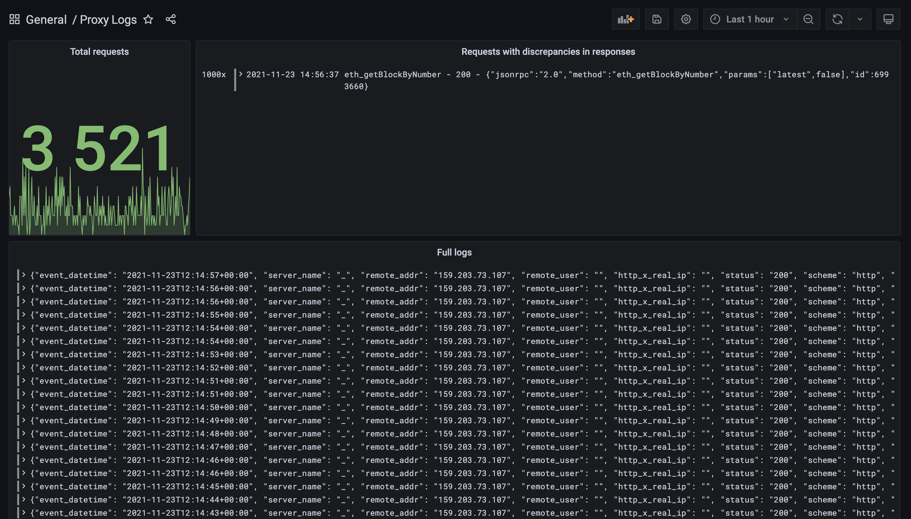

# JSONRPC Proxy


**It's an experimental code, use it at your own risk.**

## Idea
Different Ethereum nodes could produce different responses for the same requests, broadcasting requests to multiple nodes allows us to compare responses results from each node and detect discrepancies on the fly.

## Setup
To get the whole stack running you just need to copy jsonrpc.conf.example to jsonrpc.conf:
```bash
cp openresty/conf.d/jsonrpc.conf.example openresty/conf.d/jsonrpc.conf
```
and set IP addresses of the nodes in the upstream:
```
upstream @api {
    server <ipnode1>:8545;
    server <ipnode2>:8545 backup;
}
```
*Notice: Currently only IP addresses are supported*

## Run
You need to set secure password in the docker-compose.yml or set ENV variable for it and run:
```bash
docker-compose up -d
```

## Grafana
If everything went well, you'll be able to connect to grafana at http://yourIP:3000 with provided credentials.

## How to use
By default proxy will listen at 8546 port, so you can test it like this:
```bash
curl --data '{"jsonrpc":"2.0","method":"eth_gasPrice","params":[],"id":7357}' -H "Content-Type: application/json" -X POST <your IP>:8546/broadcast/
```
You will get response from the first node defined in upstream section, all comparison will be made in background and logged to Loki via pre-configured syslog-ng.

## TODO
Currently it just compares unordered JSON and generate a lot of false positive results.  
- [ ] Implement jsondiff that will deeply compare JSON results.